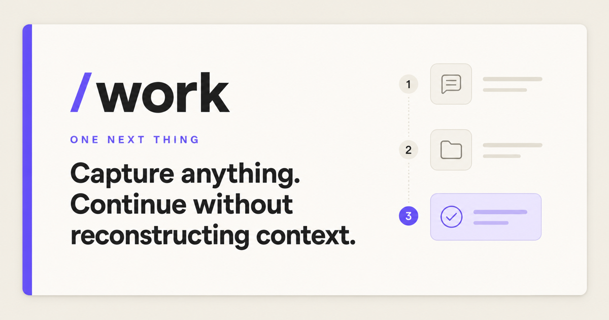
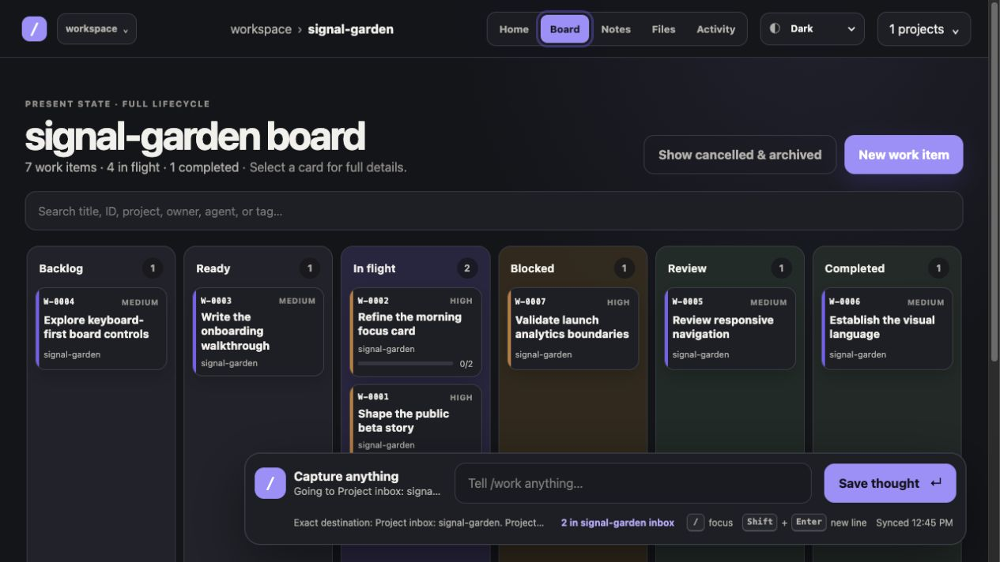
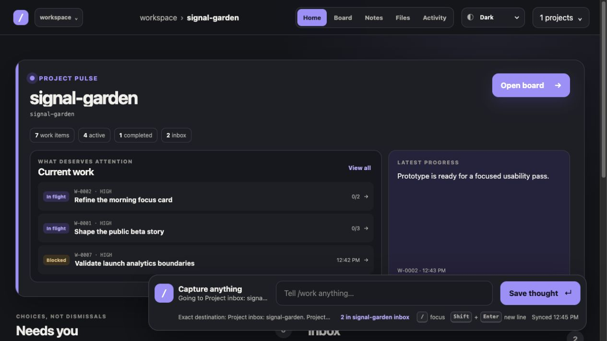
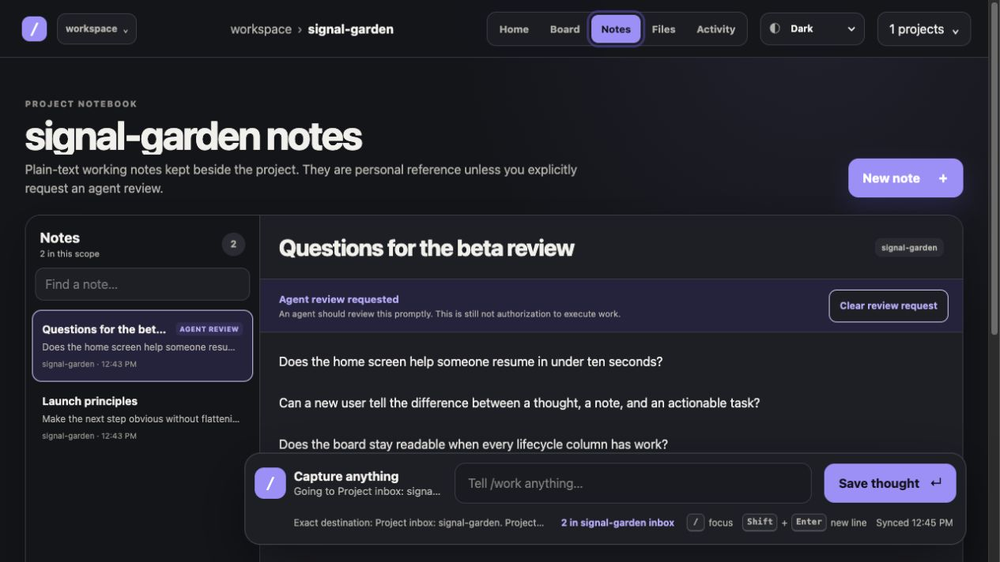
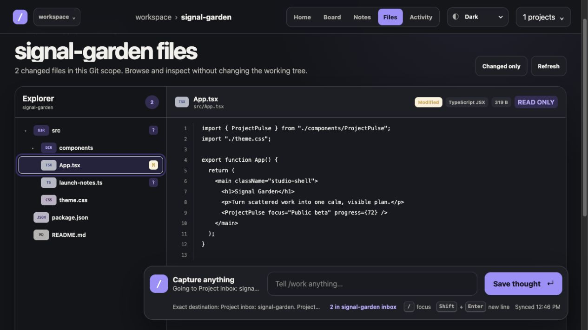
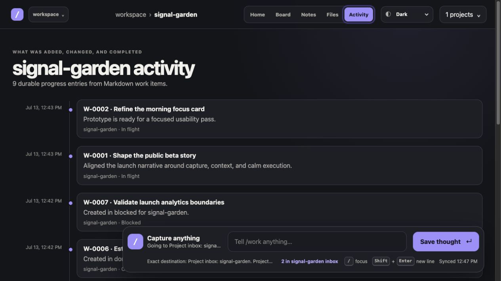

# Work




Work stores project tasks, captures, ideas, notes, and decisions as local files for
people and agent teams managing many repositories. The home screen prioritizes
capture and resumption; Ideas, Board, Files, and Activity expose possibilities,
current work, a read-only source reference, and durable history.

Requires Node.js 22.13 or newer and npm.

## See Work in action

The screenshots below use a fictional project; no private workspace data is
included.

### Keep the whole lifecycle visible



<table>
  <tr>
    <td width="50%">
      <strong>Resume without reconstructing context</strong><br><br>
      
    </td>
    <td width="50%">
      <strong>Keep reference notes beside the project</strong><br><br>
      
    </td>
  </tr>
  <tr>
    <td width="50%">
      <strong>Inspect source without turning Work into an editor</strong><br><br>
      
    </td>
    <td width="50%">
      <strong>Follow durable progress over time</strong><br><br>
      
    </td>
  </tr>
</table>

## Start Work for a root directory

Install the public npm package once:

```bash
npm install --global slash-work
```

Then enter any directory that contains projects and run one command:

```bash
cd /path/to/my-projects
work
```

Update to the newest published version at any time:

```bash
npm update --global slash-work
```

Contributors can instead clone the repository, run `npm install`, and use
`npm link` to test the current source checkout globally.

Work opens the local address in your browser and also prints it in the terminal.
Pass `--no-open` when you do not want that. Work listens on the loopback
interface only; it is not published to the internet and does not require a
hosted account.

On first launch, the selected directory becomes the workspace root. On later
launches inside one of its descendants, Work finds the nearest ancestor
containing `.work/workspace.json`, resumes it, and opens at that descendant's
folder scope. Use `work --init` when you intentionally want the current
directory to become a separate nested workspace.

Every launched root is also registered in `~/.work/roots.json`. After that you
can start `work` without a path and switch among recent roots from the root
button in the web header—including from a narrow phone-sized browser. Use
**Choose folder…** to open the operating system's folder picker. Selecting a
directory registers it and creates its top-level `.work/` workspace when
needed. The CLI remains available for scripted setup:

```bash
work register ~/Home
work register ~/Hacking
work register ~/Career
work roots
```

Use **Remove** beside a non-current root, or
`work unregister <id-or-path>`, to remove an entry from the picker. This only
forgets the recent root; it never deletes the directory, `.work/`, or any
artifact. The browser never receives a general filesystem-browsing API or
submits a typed path. The loopback Work process opens the native picker after
an explicit local button press and accepts only the directory returned by the
operating system.

The root control beside the Work brand shows the current workspace and opens
only workspace management: switch roots, remove a remembered root, or choose
another folder. The slash mark opens a separate system menu. Work quietly checks npm every six hours
while the interface is open and marks the slash when a newer version is
available. **Check now** performs a manual check. A global npm installation can
use the confirmed **Install & restart** action to install that exact published
version, replace the current loopback service, and reload the interface. Source
checkouts report updates but must be updated with Git. **Restart Work** remains
available in the same system menu for reloading the service without changing
files or versions.

The selected workspace root is a hard visibility boundary. Work can discover
projects below it, but it does not scan its parent or siblings. Switching the
picker changes the boundary for that browser; records from different roots are
never combined.

Projects are explicit. The preferred marker is a project-owned `.work/`
directory containing `project.json`. Initialize it by creating the directory;
Work writes the marker the next time it discovers the project. Existing empty
`.project` files and `.project/` directories remain supported and are upgraded
without deleting the legacy marker. Git repositories, package manifests, build
files, and scratch directories are ignored unless you mark them:

```bash
mkdir -p path/to/project/.work
```

Linked Git worktrees of a marked project are treated as aliases, not additional
projects. Work reads and writes the primary worktree's `.work/` store even when
the CLI or UI is launched from a linked worktree.

## What is saved

Work keeps human-readable Markdown beside the thing it describes. The selected
root's `.work/` contains `workspace.json` plus unassigned captures, ideas,
notes, tasks, and decisions. Every project has its own `.work/project.json`,
`.work/tasks/`, `.work/captures/`, `.work/ideas/`, `.work/notes/`, and
`.work/decisions/`.
Notes use a plain-text body with a small metadata header so both people and
agents can read them without a special editor. Every note records an explicit
`agentIntent`: `reference_only` means context, never an instruction, while
`review_requested` asks an agent to review it promptly without authorizing
execution. Assigning or reassigning a
record moves its file to the owning project; moving the whole project folder
therefore moves its work and history too. Everything survives browser
refreshes, server restarts, and a different browser on the same computer.
Browser storage may remember harmless interface preferences, but it is not the
source of truth for work.

This means the workspace can be backed up, searched, inspected, and versioned
with ordinary file tools. Deleting browser data does not delete the work log.
Do not commit `.work/` if the workspace contains private operational notes.

## Everyday use

- Press `/`, type a messy thought, and press Enter. Use `Shift+Enter` for new
  lines when the thought is a list or needs more room. It is saved immediately;
  choosing a project is optional.
- Type `/work task: describe the outcome` to create a backlog card without
  opening a form, or promote any Inbox thought with **Make task**.
- Open **Notes** for longer plain-text thoughts. Create or select an individual
  note, write without formatting, and let Work save it beside the current
  project. Notes are reference-only by default. **Ask agent to review** marks a
  note for prompt review; use a task card when you want execution. Deleting a
  note requires a second confirmation.
- Open **Ideas** when a thought is worth evaluating but is not yet a proposal,
  decision, or task. **Ask agent to evaluate** authorizes analysis only—never
  implementation. Mark an idea **Not now** or **Closed** with a durable reason,
  or develop it toward a proposal and scoped work later.
- Open **Files** for a read-only, scope-bound tree and text preview. Language
  badges and Git markers make modified, added, and untracked files easy to
  spot. A project with linked worktrees gets an explicit checkout selector so
  each working tree can be inspected without becoming a separate project.
  Generated folders, Work metadata, secrets, binaries, symlinks, and oversized
  files are not exposed as source previews.
- Open **Board** to see Backlog, Ready, In flight, Blocked, Review, and
  Completed. Drag cards between columns or use the accessible status control.
- Open a card for project, type, priority, human owner, agent teams, tags,
  dependencies, blockers, requirements, acceptance criteria, plan, notes,
  completion summary, timestamps, and its append-only progress log.
- Open **Activity** to understand what was added, changed, blocked, completed,
  cancelled, or archived across the current directory scope.
- Start at **All in this root** to see the root, a folder to see a group, or a
  project to see only that project.
- Use **Needs you** for an actual choice. A decision exposes its real
  alternatives—such as selecting a project or keeping something
  unassigned—plus **Decide later** and **Cancel** where safe. Opening a card
  does not silently approve it.
- Stop the local process with `Ctrl-C`. Run the same command later to resume
  from the files already in `.work/`.

Agents and terminal users use the same records:

```bash
work idea "Federate remote Work instances" --detail "Explore read-only project trees across servers"
work task "Implement the board" --project software/rekit --priority high
work move W-0001 in_progress --note "UI team started"
work log W-0001 "Requirements and dependency gate pass"
work list
work show W-0001
```

A fresh agent can discover the installed version's capabilities from any
directory without initializing a workspace or starting the service:

```bash
work agent operations
work agent instructions tasks.create
work agent instructions notes.request-review --json
work agent schema task
```

The operation index stays small; the agent loads rules and input schemas only
for the operation it needs. A running service exposes the same catalog at
`GET /api/agent`, task-scoped guides below `GET /api/agent/operations/`, and
OpenAPI 3.1 at `GET /api/openapi.json`. Instructions are bundled with the npm
version rather than copied into `.work/`, and describe capabilities without
granting authority. See
[`docs/AGENT-CAPABILITIES.md`](docs/AGENT-CAPABILITIES.md) for the complete
contract.

See [`docs/LOCAL-WORKSPACE.md`](docs/LOCAL-WORKSPACE.md) for discovery,
containment, storage, and recovery details.
Automations that write the filesystem records directly should follow the
[`Work Artifact Markdown Contract`](docs/ARTIFACT-SCHEMA.md) and validate their
logical payloads with
[`schemas/work-artifact.schema.json`](schemas/work-artifact.schema.json).

## Development and validation

Launch Work from the checkout to run the API and Vite interface together:

```bash
npm run work -- /path/to/a/test-root --no-open
```

Run the complete build and test suite before submitting a change:

```bash
npm test
```

Releases use npm trusted publishing rather than a stored npm token. After
updating `package.json` and `package-lock.json`, merge the release commit and
push a matching version tag such as `v0.2.4`. The
[`publish.yml`](.github/workflows/publish.yml) workflow verifies the tag, runs
the complete test suite, and publishes through GitHub Actions OIDC. The npm
package must trust `batteryshark/slash-work` and the `publish.yml` workflow.

The product acceptance gates and five-minute human scenario live in
[`docs/ADHD-USABILITY-STANDARD.md`](docs/ADHD-USABILITY-STANDARD.md).

## Repository layout

- `app/` contains the React interface and styles.
- `bin/` contains the `work` CLI and local process launcher.
- `lib/` owns workspace discovery and the filesystem record store.
- `server/` exposes the loopback-only JSON API.
- `tests/` covers the interface contract, storage, containment, worktrees, and
  lifecycle behavior.
- `docs/` defines the local workspace and ADHD usability contracts.

## License

Work is available under the [MIT License](LICENSE).
