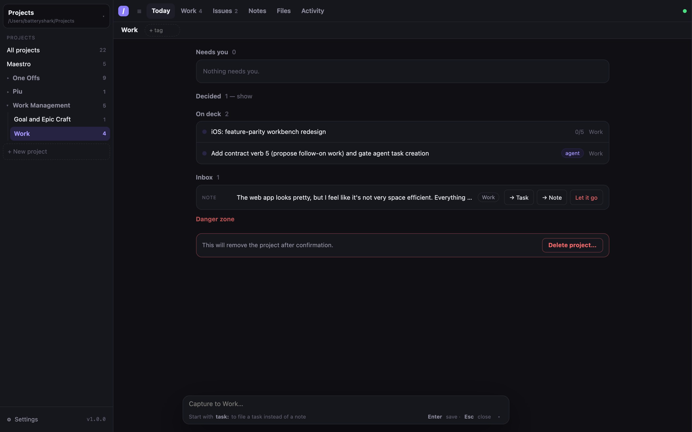
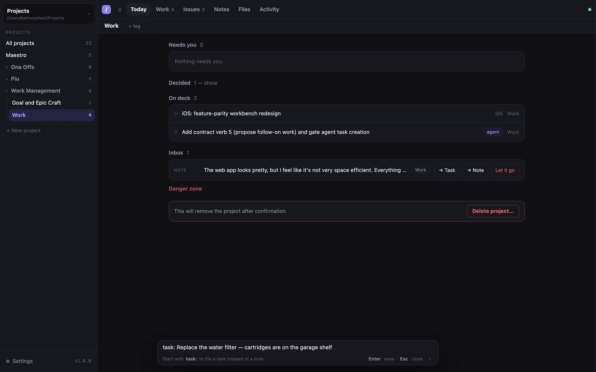
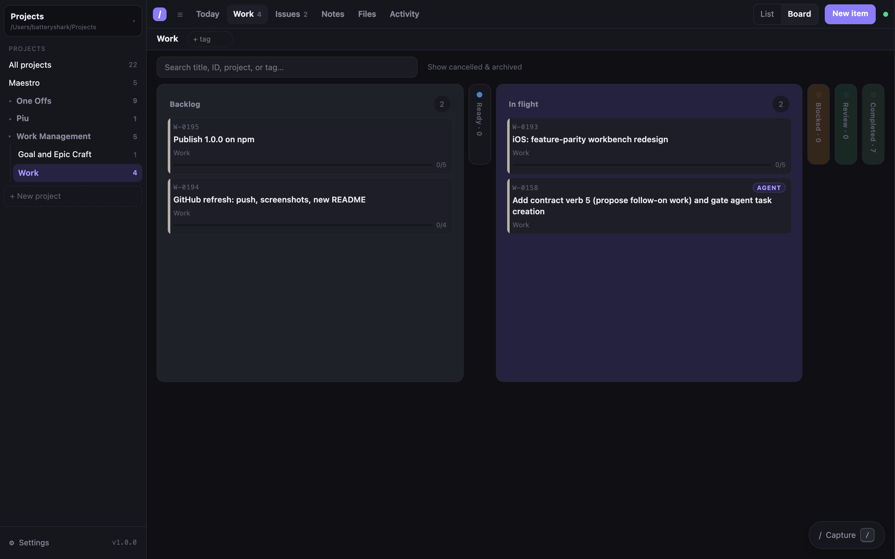
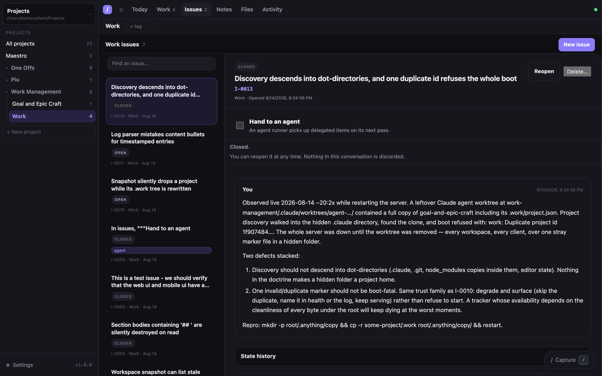

# Work

[](https://www.npmjs.com/package/slash-work)

Every task, issue, and note is a markdown file stored beside the work it
describes. Agents operate on those files under a contract.

## Why this exists

Task trackers die because capture costs too much. A form that demands a
title, a project, and a priority kills the thought before it lands. At the
same time, agents need a substrate they can read and write without a vendor
API — and that substrate already exists: files. Work fixes both at once:
capture in one keystroke, records as plain files, and a contract that states
exactly what an agent may do to them.

## The workbench

A keyboard-first workbench over your file tree.


*The Today tab: left rail with roots, project tree, and tags; a read-first
task panel that becomes editable on click.*


*Capture: press `/` anywhere and type. Prefix with `task:` to create a task
instead of a note. No form, no required fields.*


*Work as a board or a list. Quick-add with Tab to indent subtasks; drag a
task to reparent it.*


*Issues are open or closed, GitHub-style. State changes carry their reason
in the thread; agent writes are attributed to their run.*

- Left rail: roots, project tree, tags. Scoped tabs: Today, Work, Issues,
  Notes, Files, Activity.
- Read-first panels. Text is text until you click it.
- Paste a screenshot into any record. It is stored as a plain file beside
  the record, not in a blob store.
- Workspace-wide `W-####` task and `I-####` issue ids, like a tracker,
  without the tracker.
- Multiple roots — work laptop, home server, archive. Each root has an id
  floor, so id ranges never collide when trees meet.

## Quick start

```bash
npm install -g slash-work   # or: npx slash-work
cd ~/projects
work                        # serves the UI, prints the local URL
```

The server binds to loopback. `work --tailscale` binds to your tailnet
address instead. It never binds `0.0.0.0`.

The CLI writes the same files as the UI:

```bash
work new "Fix the login timeout" -p software/rekit
work list -p software/rekit --open
work check W-0412 2                     # tick acceptance criterion 2
work update W-0412 --status done
```

## The file format

Every record is a markdown file with single-line JSON frontmatter. Records
live in `.work/` directories beside the actual work — the root holds
unassigned records, each project holds its own. Grep them, diff them, sync
them, back them up. They are yours.

```markdown
---
id: "W-0412"
title: "Replace the water filter"
status: "ready"
project_path: "home/house"
delegated: false
tags: ["maintenance"]
created_at: "2026-08-14T09:12:00.000Z"
updated_at: "2026-08-14T09:12:00.000Z"
---

## Description

Cartridges are on the garage shelf, top left. Shut the valve first.
```

Projects are anything with a `.work/` directory — software and life projects
alike. Move the folder and its records move with it.

## Agents

One human, their projects, and a contract for agents. The contract is the
product's spine; the full text is in [CONTRACT.md](./CONTRACT.md).

- The **Hand to an agent** checkbox is the only delegation signal. Agents
  claim delegated items; they never self-select work.
- Agents write back through five verbs: comment, transition, attach an
  artifact, file a new issue, propose follow-on work — parented to the
  delegated goal, never top-level.
- Agents never set `done` on a task. The human closes tasks.
- An agent may close its claimed issue, but only with a resolution summary.
  A human can always reopen.
- Agents never edit human-authored text. Every agent write is attributed to
  its run identity.

Agent runners are external consumers of the API and the files. Work ships no
model client and calls no model.

## iOS

A native companion app lives in [`ios/`](./ios). It connects to a
`work --tailscale` instance, remembers multiple servers, and keeps the last
snapshot for read-only access when the machine is offline. Capture, Today,
issues, and task detail work from a phone.

## Philosophy

Work is a system of record, not a platform.

- No cloud, no accounts, no telemetry.
- No embedded model client. AI reaches Work only as an external, attributed
  client.
- No federation. One Work instance per machine; reach another machine over
  its own Tailscale-bound instance.
- One writer per tree. Sync the files with any tool you trust, but give each
  live tree one running service.
- Files first. If Work disappeared tomorrow, your records would still be
  readable markdown.

MIT licensed. See [LICENSE](./LICENSE).
